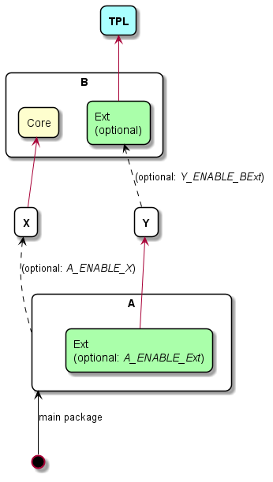
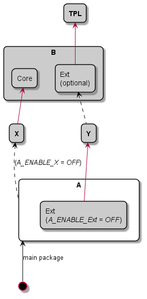
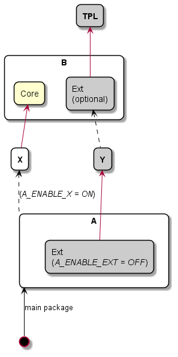
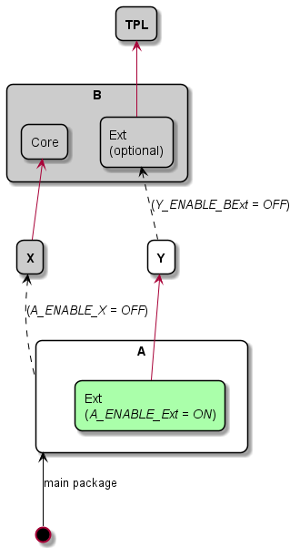
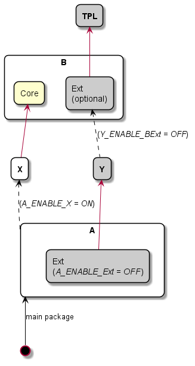
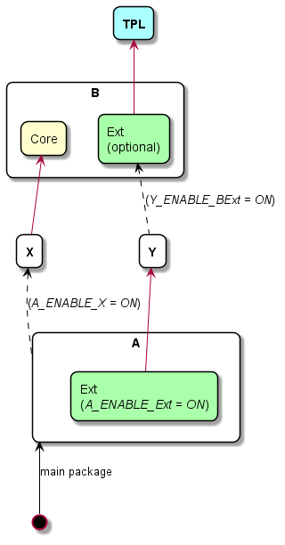

# Example

## Structure

This example is composed of five packages - placed in subfolders named after them:
* `A`: main package
* `B`: base backage with `Core` required component and `Ext` optional component
* simple `X` and `Y` intermediate packages without components
* `TPL` extarnal package



> *Note:* Each package can be a build entry: e.g. `cmake -B build -S X` builds with `X` as main package.

## Features

This example demonstrates:
* Package components: `Core` and `Ext` in packages `A` and `B`;
* Optional components that can be disabled with build options:
  - `Ext` in `A` (`A_ENABLE_Ext = ON`);
  - `Ext` in `B` (triggered by dependecy);
* Dependencies:
  - package to package: `A` → `X`;
  - package to component(s): `X` → `Core` and `Y` → `B.Ext`;
  - component to package: `A.Ext` → `Y` and `B.Ext` → `TPL`;
* Optional dependencies that can be disabled with build options:
  - `A` → `X` (`A_ENABLE_X = ON`);
  - `Y` → `B.Ext` (`Y_ENABLE_BExt = ON`).
* External library `TPL` treated as other packages without requirement for dependency resolution interface (adaptation);

This example also demonstrates inconsitent diamond dependency challenge: naive method without prior graph investigation can fail to connect package `B` with both required components if `add_subdirectory()` is called for `A`, then for `X` and then for `B`. In such case only `Core` component (required by `X`) would be enabled on `B` as `Y` (that requires `B.Ext`) has not been visited yet. When `Y` tries to enable `B` with `Ext` component, it won't be able to as `B` can only be added once - either with `add_subdirectory()` or with `find_package()`.

# CMake files

Packages in this example have simple _CMakeLists.txt_ files that:

1. Configure project:
```cmake
project(A LANGUAGES NONE)
cmake_minimum_required(VERSION 3.19 FATAL_ERROR)
```
2. Trigger dependency resolution with `add_and_resolve_package_dependencies()`:
```cmake
include(../../cmake/DependencyResolver.cmake)

add_and_resolve_package_dependencies(${CMAKE_CURRENT_BINARY_DIR}/upstream)
```
> *Note:* this step is skiped in `TPL` external package, whih is not aware of dependency resolution

3. displays package name and enabled components:
```cmake
message("@ Configured ${PACKAGE_NAME}: ${PACKAGE_COMPONENTS}")
```

## Build options

Application defined build option:
* `A_ENABLE_Ext`: enables `Ext` component in `A` package (see [A/cmake/GetPackageComponents.cmake](A/cmake/GetPackageComponents.cmake));
* `A_ENABLE_X`: enables `A` → `X` dependency (see [A/cmake/GetPackageComponents.cmake](A/cmake/GetPackageComponents.cmake));
* `Y_ENABLE_BExt`: enables `Y` → `B.Ext` dependency (see [Y/cmake/GetPackageComponents.cmake](Y/cmake/GetPackageComponents.cmake));

> *Note:* Described build options are translated into `PACKAGE_COMPONENTS` and `PACKAGE_DEPENDENCIES` by respective package callbacks

## Builds

### Minimal

CMake command:
```shell
cmake -DA_ENABLE_Ext:BOOL=OFF -DA_ENABLE_X:BOOL=OFF -B build -S ./A
```
CMake output:
```
Finished configuration of upstream packages
@ Configured A:
-- Configuring done
-- Generating done
```



### `A_ENABLE_X:BOOL=ON`

CMake command:
```shell
cmake -DA_ENABLE_Ext:BOOL=OFF -DA_ENABLE_X:BOOL=ON -B build -S ./A
```
CMake output:
```
@ Configured B: Core
@ Configured X: *
-- Finished configuration of upstream packages
@ Configured A:
-- Configuring done
-- Generating done
```



### `A_ENABLE_Ext:BOOL=ON`

CMake command:
```shell
cmake -DA_ENABLE_Ext:BOOL=ON -DA_ENABLE_X:BOOL=OFF -DY_ENABLE_BExt:BOOL=OFF -B build -S ./A
```
CMake output:
```
@ Configured Y: *
-- Finished configuration of upstream packages
@ Configured A: Ext
-- Configuring done
-- Generating done
```



### `A_ENABLE_X:BOOL=ON`

CMake command:
```shell
cmake -DA_ENABLE_Ext:BOOL=OFF -DA_ENABLE_X:BOOL=ON -DY_ENABLE_BExt:BOOL=OFF -B build -S ./A
```
CMake output:
```
@ Configured B: Core
@ Configured X: *
-- Finished configuration of upstream packages
@ Configured A:
-- Configuring done
-- Generating done
```



### Maximal

CMake command:
```shell
cmake -DA_ENABLE_Ext:BOOL=ON -DA_ENABLE_X:BOOL=ON -DY_ENABLE_BExt:BOOL=ON -B build -S ./A
```
CMake output:
```
@@ Configured Third-party Library
@ Configured B: Core;Ext
@ Configured X: *
@ Configured Y: *
-- Finished configuration of upstream packages
@ Configured A: Ext
-- Configuring done
-- Generating done
```


